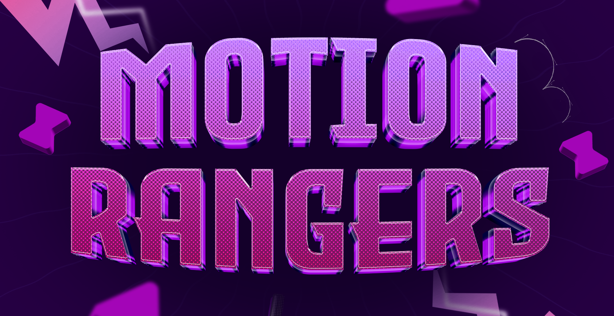

# 

# ⚡ Infos da Comunidade Motion Rangers

_Bem-vindx ao nosso grupo de Motion Design no WhatsApp!_  
Nosso objetivo é criar uma comunidade colaborativa para profissionais e entusiastas de Motion Design, Ilustração, Design e áreas relacionadas. 🎨

Aqui você vai encontrar links e informações relevantes da nossa comunidade!

---

## 🔗 Links Rápidos
* 🔵 **Discord:** [Entrar no Servidor](https://discord.gg/NvuNffxRbz)
* 🟢 **WhatsApp:** [Entrar no Grupo](https://chat.whatsapp.com/CZyMr2pmdY7BY4seynmNII)
* ☁️ **Nuvem (MEGA):** [Acessar Conteúdo](https://mega.nz/folder/SzQUjTSZ#kc8nNME-HUKBITO1ZJJCSQ)

---

## 📜 Regras de Convivência

<b>Clique para ver nossas regras de convivência.</b>

1. **Respeito é essencial**  
   Trate todxs com respeito e empatia. Ofensas ou ataques pessoais são proibidos.
2. **Inclusividade e acolhimento**  
   Respeitamos todas as identidades. Use pronomes escolhidos por cada pessoa.
3. **Promoção com moderação**  
   Divulgue seus trabalhos, mas não transforme o grupo em um mercado.
4. **Cuidado com links**  
   Apenas fontes confiáveis. Links suspeitos podem gerar suspensão.
5. **Evite spam**  
   Mantenha o foco em trocas e aprendizado.
6. **Privacidade**  
   Não compartilhe dados alheios sem autorização.
7. **Moderação**  
   Conflitos devem ser tratados diretamente com os moderadores.
8. **Divirta-se!**  
   Contribua para um ambiente positivo.

---

## 📜 Regras de Comunicação

<b>Clique para ver nossas regras de comunicação.</b>

1. **Foco Total em Motion & Trabalho**  
   O assunto principal aqui é Motion Design, mercado, referências, dúvidas técnicas e oportunidades. Assuntos externos (política, religião, futebol, etc.) devem ser evitados para manter o chat limpo e focado.
2. **Papo no Discord**  
   Quer papear sobre outros temas? O Discord está lá para isso! Temos canais separados para interagir com mais liberdade sobre qualquer assunto, seguindo as regras de convivência básicas.
3. **Qualidade da Informação (Sem "Achismo")**  
   Vamos elevar o nível do debate. Ao dar conselhos técnicos ou de mercado, baseie-se em fatos ou experiências reais. Evite frases de efeito, "ouvi dizer" ou palpites sem fundamento que possam confundir outras pessoas.
4. **Memes e Figurinhas (O Uso Consciente)**  
   Não somos robôs, mas vamos evitar o flood. Memes e figurinhas são permitidos apenas se estiverem no contexto de Motion/Trabalho. Se a piada for sobre outro tema ou não agregar na discussão, guarde para o privado ou Discord.
5. **Respeito e Objetividade**  
   Dúvidas sempre são bem-vindas, mas antes de perguntar, dê uma busca rápida no histórico do grupo. Ao responder, faça de forma direta e cordial. O tempo de todo mundo aqui é valioso!
6. **Exceções Raras**  
   Notícias de grande impacto direto no nosso setor (ex: mudanças em softwares, leis de direitos autorais, mudanças trabalhistas ou fiscais) podem ser compartilhadas, desde que a discussão não fuja da temática profissional.

---

## 🛠️ Instruções e Avisos

<b>Como descompactar os cursos (.7z)</b>

> **Nota:** Os cursos foram compactados para evitar problemas de direitos autorais.

### Programas Sugeridos:
* **Windows/Mac:** [7-Zip](https://www.7-zip.org/)
* **Windows 11 (Otimizado):** [NanaZip](https://apps.microsoft.com/detail/9n8g7tscl18r)
* **Mac (Otimizado):** [Keka](https://www.keka.io/pt-br/)

### Como proceder:
1. Baixe **todos** os arquivos da pasta (`.7z`, `.7z.002`, etc).
2. Selecione apenas o **primeiro** arquivo (`.7z`).
3. Clique com o botão direito e escolha "Extrair aqui".

---
_Desenvolvido com 💜 pela comunidade Motion Rangers._